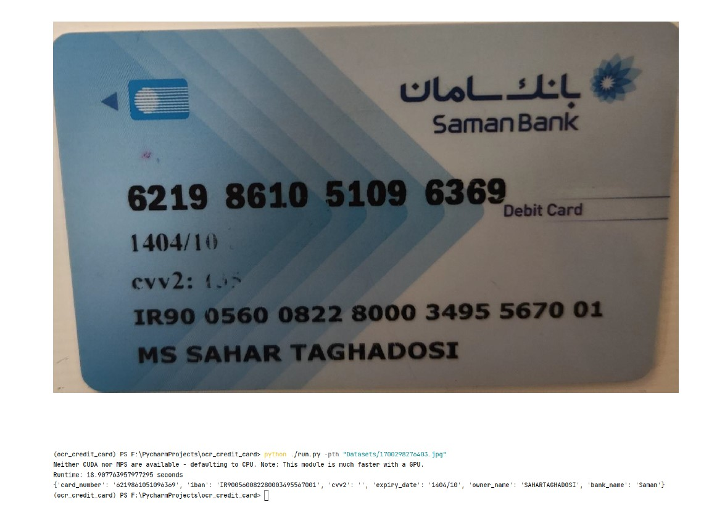

# OCR Image Processing

This Python script performs Optical Character Recognition (OCR) on images. It includes various image processing strategies and OCR data extraction.

## Installation

1. Install the required packages using pip:

   ```
   pip install -r requirements.txt
   ```

   This will install the necessary packages, including OpenCV, EasyOCR, NumPy, Matplotlib, Singleton Decorator, and Pillow.

2. Create Env python: 3.10.13

## Predict

```bash
python ocr_credir_card/Src/Main_Algorithm/run.py -pth ocr_credir_card/Evaluate_Dataset/"MicrosoftTeams-image (2).png"
```

## Usage

1. Process the image using the selected strategy:

   ```python
   from ocr_credir_card.Src.Main_Algorithm.ocr import OCRReader, OCRDataProcessor
   from ocr_credir_card.Src.Main_Algorithm.utils.pre_proc import ImageProcessor, MakeNumbersBolderStrategy

   image_processor = ImageProcessor(MakeNumbersBolderStrategy())
   img = image_processor.process(img_path)  # Use the provided image path
   ```

   Available strategies:
      - `MakeNumbersBolderStrategy`: Enhances the image to make numbers bolder.

2. Convert the processed image to RGB format for OCR:

   ```python
   img = cv2.cvtColor(img, cv2.COLOR_BGR2RGB)
   ```

3. Use the OCRReader (Singleton) to read text from the image:

   ```python
   ocr_reader = OCRReader()
   results = ocr_reader.read_text(img)
   ```

4. Run the following command:
```python
   ocr_processor = OCRDataProcessor()
   groups = ocr_processor.group_and_sort_ocr_data(results)
   extracted_card_info = ocr_processor.extract_card_info(groups)

   print(extracted_card_info)
```

## Example



## License

This project is licensed under the Holoo License.