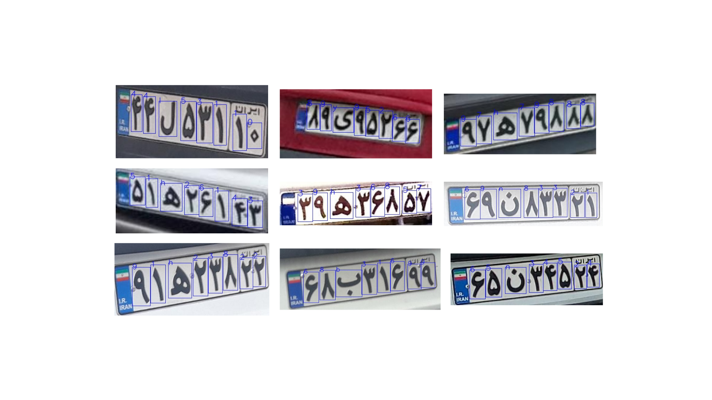

# Plate OCR Project Overview
***

## Introduction
***

This project focuses on **License Plate OCR** (Optical Character Recognition for license plates). The entire algorithm consists of two key steps. Firstly, the model detects license plates within images containing entire cars using YOLOv8s. This step involves cropping the plates and labeling them as "plate_area." Subsequently, it employs the YOLOv8s detection model to detect and classify individual letters on the license plates.



## Some News
***

- **22 Jan 2024** The algorithm for detecting missing characters has been refined, demonstrating an improved accuracy of 90% on the test samples with missing characters.

## Project Features
***

1. **Missing Character Detection:**
   The designed algorithm can detect up to two missing characters. It returns all output as asterisks when more than two characters are missing.

2. **Confident Car Selection:**
   The algorithm selects the most confident car in plate detection when multiple cars appear in the frame.

3. **Duplicate Box Removal:**
   The algorithm removes duplicate boxes in detection.

## Project Structure
***
- **Datasets:**
  - `IR_LPR`: Used for the main module evaluation in `Src/Main_algorithm/Test`.
  
- **Model:**
  Model weights are located in the `Model` directory. The current weight in `OCR_0` is utilized twice, once for plate detection and once for character detection.

- **Src:**
  All source code is organized within this directory, including:
  - `Main_algorithm/Codes`: Contains the main module `main.py`.
  - `Main_algorithm/Doc`: Contains the flowchart of algorithm and the input/output of the main module.
  - `Main_algorithm/Test`: Contains the test of the module `test.py`. This file was developed for QA not backendside.

## Installation
***

You can run this project, install the required packages using pip. All codes are run by `python 3.10.13`.

### Pip Installation

1. Run the following command:
```bash
 pip install torch==2.0.1 torchvision==0.15.2 --index-url https://download.pytorch.org/whl/cu117
```

2. Navigate to the `ocrPlate/Src/Main_Algorithm` directory of the project.
3. Run the following command:

```bash
pip install -r requirements.txt
```

## Usage
***

You can use the Plate OCR algorithms by following these steps:

1. Import the main class and opencv:

```python
from ocrPlate.Src.Main_Algorithm.Codes.main import OCRModel
import cv2
```

2. Instantiate the model with the appropriate parameters.

```python
ocr_model = OCRModel(model_path="ocrPlate/Models/OCR_0/best.pt",
                     plate_conf=0.6,
                     char_conf=0.5,
                     plate_iou=0.7,
                     char_iou=0.7,
                     plate_imgsz=(640, 640),
                     char_imgsz=(320, 320),
                     device='cpu')
```

3. Read the input image.

```python
car_image = cv2.imread('path_to_desired_image')
```

4. Call the character detection method.

```python
detection_list, median_conf, detected_car = ocr_model.detect_character(car_image)
```

`detection_list` is the ocr detection of the algorithm.
`median_conf` is the median confidence of all detected character confidences in the plate.
`detected_car` whether car is detected or not.


**Description:**

There are eight parameters in `OCRModel` as initialization (The OCRModel will be called once):

1. `model_path (str)`: Path to the YOLO model used for object detection.
2. `plate_conf (float)`: Confidence threshold for plate detection (default is 0.6).
3. `char_conf (float)`: Confidence threshold for character detection (default is 0.5).
4. `plate_iou (float)`: IOU threshold for plate detection (default is 0.7).
5. `char_iou (float)`: IOU threshold for character detection (default is 0.7).
6. `plate_imgsz (tuple)`: Image size for plate detection (default is (640, 640)).
7. `char_imgsz (tuple)`: Image size for character detection (default is (320, 320)).
8. `device (int or str)`: device to run on, i.e. cuda device=0/1/2/3 or device='cpu'. int type for gpu and str type for cpu (default is 0).

Then **detect_character(car_image)** method will be called infinitely.

The input of the `detect_character(car_image)` method is a image contains car. The type of the input is: numpy.ndarray.
The output of the `detect_character(car_image)` method will be:
1. `detection_list`: a list like `['p1', 'p2', 'p3', 'p4', 'p5']`. If plate was not detected it will be: `[None, None, None, 'p4', None]`
2. `median_conf`: a float number. This value is a threshold which helps us to decide whether plate is legible or not. **My suggested value for this variable is 0.84**.
3. `detected_car`: a boolean flag. This value tells us whether car is detected or not.


**Remarkable Note:**
1. The diagram in the `ocrPlate/Src/Main_Algorithm/Doc` directory, so if you encounter any issues, please feel free to contact me.

## Test (For QA)
***

You can test the algorithms by following these steps:

1. Navigate to the `Src/Main_Algorithm/Test` directory within the project.
2. Run the following command in terminal for the device which has GPU (`--device` for device determination and `--runs_num` for the number of times we repeat the model detection so that the valid runtime is reported:
```bash
python test.py --device 0 --runs_num 100
```
and run the following command in terminal for the device which has not GPU (CPU):
```bash
python test.py --device 1 --runs_num 100