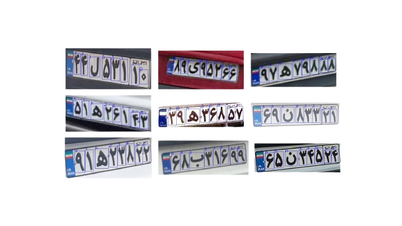

# PersicaGlyph OCR: Persian License Plate Recognition System
PersicaGlyph OCR is a state-of-the-art Persian license plate recognition system utilizing the YOLOv8 small model for fast and accurate detection and character recognition. Designed for seamless integration into traffic monitoring and vehicle identification workflows, this tool stands out for its speed, accuracy, and ease of use.

## Table of Contents
- [Introduction](#introduction)
- [Features](#features)
- [Setup](#setup)
- [Build and Test](#build-and-test)
- [Parameter Explanation](#parameter-explanation)
- [Demonstration](#demonstration)
- [Explore Our Kernel 🚀](#explore-our-kernel-)
- [Technology Stack](#technology-stack)
- [License](#license)
- [Contributing](#contributing)
- [Credits and Acknowledgements](#credits-and-acknowledgements)
- [Contact Information](#contact-information)

## Introduction
PersicaGlyphOCR is an advanced OCR system designed for the precise recognition of Persian license plates. Leveraging the YOLOv8 small model, it offers fast and reliable detection of license plates and their alphanumeric characters using a single unified model. This system is ideal for applications such as traffic monitoring and automated vehicle identification.

## Features
- **Single-Model Detection and OCR**: Employs YOLOv8s for both license plate detection and character recognition.
- **High-Speed Processing**: Utilizes the YOLOv8 small model for rapid processing, suitable for real-time applications.
- **Precision in Detection and Character Recognition**: Accurately identifies Persian license plates and characters.
- **Customizable Parameters**: Adjustable settings for detection and OCR to cater to various requirements.

## Setup

1. **Python Environment**: 
    Ensure Python 3.10.13 or later is installed.
2. **Dependencies**: 
    Before installing the project dependencies, ensure you have PyTorch installed. PyTorch can be installed via pip or conda, depending on your preference and system setup. Visit the [PyTorch official website](https://pytorch.org/get-started/locally/) for installation instructions tailored to your platform.
    ```bash
    pip install -r requirements.txt
    ```
3. **Model Weights**:
    - Download the YOLOv8 model weights and license plate specifications from [this link](https://drive.google.com/file/d/1DvKWOKv6w3eBF1l5ONJbutOmyYIA0rFh/view?usp=sharing).
    - Create a `Models`` directory in the root of the project.
    - Place the downloaded file inside the `Models` directory and extract them using the passphrase: `PersicaGlyph_OCR`.

## Build and Test
Execute `run.py` with the following arguments:

```bash
python run.py \
  --runs_num [number] \
  --input_dir [path] \
  --output_dir [path] \
  --model_path [path, optional] \
  --plate_conf [float, optional] \
  --char_conf [float, optional] \
  --plate_iou [float, optional] \
  --char_iou [float, optional] \
  --plate_imgsz [tuple, optional] \
  --char_imgsz [tuple, optional]
```
---

### Parameter Explanation
- `--runs_num`: Number of times the detection is repeated for runtime evaluation.
- `--input_dir`: Directory path containing the test images.
- `--output_dir`: Directory path where the results will be saved.
- `--model_path`: (Optional) Path to the YOLO model. Default is `"./Models/PGO_Weights.pt"`.
- `--plate_conf`: (Optional) Confidence threshold for plate detection. Default is `0.83`.
- `--char_conf`: (Optional) Confidence threshold for character detection. Default is `0.5`.
- `--plate_iou`: (Optional) IOU threshold for plate detection. Default is `0.7`.
- `--char_iou`: (Optional) IOU threshold for character detection. Default is `0.7`.
- `--plate_imgsz`: (Optional) Image size for plate detection. Default is `(640, 640)`.
- `--char_imgsz`: (Optional) Image size for character detection. Default is `(320, 320)`.

## Demonstration
The image showcases the robust detection capabilities of PersicaGlyphOCR. Our model is designed to handle a diverse array of license plate designs and formats, as evidenced by the multiple examples displayed. While the plates differ in background color, text style, and arrangement, our system can reliably identify and extract the plate region from the vehicle's image.

It's important to note that while the demonstration focuses on the character recognition aspect of the license plates, PersicaGlyphOCR is equally adept at detecting the plates themselves from a larger image of a vehicle. In these examples, we've chosen to highlight plates that represent a typical format the model can process. However, the underlying detection technology is capable of locating and reading plates of various sizes and styles, including those not depicted here.



# Explore Our Kernel 🚀
We are thrilled to unveil our cutting-edge kernel, an embodiment of innovation that integrates the audio manipulation capabilities of VoxArte Studio! It's not just a repository; it's a revolution in audio processing, built with our audio projects at its heart.

## Catch the Wave of Audio Innovation
Don't miss out on this opportunity to be a part of the audio evolution. Click the link blow, star the repo for future updates, and let your ears be the judge. If you're as passionate about audio as we are, we look forward to seeing you there!

Remember, the future of audio is not just heard; it's shared and shaped by enthusiasts and professionals alike. Let's make waves together with VoxArte Studio and our Kernel. 🚀

🔗 [Kernel Repository](https://github.com/Meta-Intelligence-Services)

---

## Technology Stack

Certainly! Below is an explanation for each of the listed dependencies, which can be included in your README file to provide users with context about the purpose of each package in your project.

---

## Dependencies

Before setting up PersicaGlyph OCR, it is important to understand the role of each dependency in the system:

- **Pickle**: A Python module that implements binary protocols for serializing and de-serializing a Python object structure. In PersicaGlyphOCR, `pickle` is used to load pre-saved mappings that relate character IDs to their unicode representations and translations.

- **Argparse**: The `argparse` module makes it easy to write user-friendly command-line interfaces. It is utilized in `run.py` to handle parsing command-line options and arguments, allowing users to configure the OCR system's parameters.

- **Ultralytics YOLO**: This is a PyTorch implementation of the YOLO (You Only Look Once) object detection algorithm. It is used for detecting objects in images with great speed and accuracy. In this project, it powers the license plate and character detection functionalities.

- **OpenCV-Python (opencv-python)**: A Python wrapper for the OpenCV library, which provides a rich set of algorithms for image processing and computer vision. PersicaGlyphOCR uses OpenCV for reading images from disk, preprocessing them before detection, and possibly for further image operations needed for post-processing.

- **Singleton Decorator (singleton_decorator)**: This is a decorator for classes in Python. When applied to a class, it modifies the class to follow the Singleton design pattern, ensuring that only one instance of the class exists throughout the application. In the OCR model, it ensures that the model is loaded into memory only once and reused, which is efficient for system resources.

- **Torch (PyTorch)**: An open-source machine learning library based on the Torch library, used for applications such as computer vision and natural language processing. It is a core dependency for running the Ultralytics YOLO model as it provides the necessary tools for deep learning and model inference.

---
Each of these dependencies plays a crucial role in ensuring PersicaGlyphOCR operates effectively, from model loading and image processing to parsing user commands and ensuring efficient resource usage.


## License
PersicaGlyph OCR is open-sourced under the MIT License. See [LICENSE](LICENSE) for more details.

## Contributing
While we deeply value community input and interest in PersicaGlyph OCR, the project is currently in a phase where we're mapping out our next steps and are not accepting contributions just yet. We are incredibly grateful for your support and understanding. Please stay tuned for future updates when we'll be ready to welcome contributions with open arms.

## Credits and Acknowledgements
We would like to extend our heartfelt thanks to Ms.Samin Heydarian for her guidance and wisdom throughout the development of PersicaGlyph OCR. Her insights have been a beacon of inspiration for this project.

## Contact Information
Although we're not open to contributions at the moment, your feedback and support are always welcome. Please feel free to star the project or share your thoughts through the Issues tab on GitHub, and we promise to consider them carefully.please [open an issue](https://github.com/Amir-Nassimi/PersicaGlyph-OCR/issues) in the PersicaGlyph OCR repository, and we will assist you.